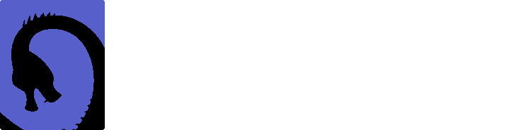
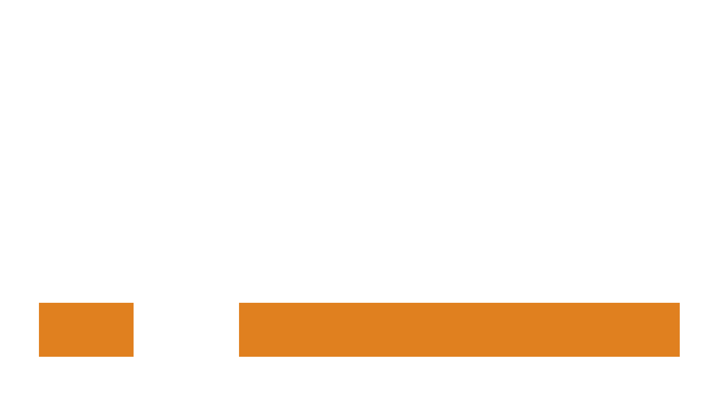

# 🐾&nbsp;&nbsp;Ari

**`Software Developer, Student & Guitarist`**

Average developer working on too many projects at once. \
Writing or learning another programming language. Probably.

## Projects

| Project | Description | Languages |
|    -    |      -      |     -     |
|  | LLVM API Wrapper | ![C++][cpp-badge] ![LLVM][llvm-badge]
|  | Programming language | ![C++][cpp-badge] ![LLVM][llvm-badge]
| [<h3>Misfire</h3>](https://github.com/Fuechs/Misfire) | Library for generating error messages | ![C++][cpp-badge]

## Stats

[cpp-badge]: https://img.shields.io/badge/C++-1a3b63?logo=cplusplus&logoColor=white&style=for-the-badge
[llvm-badge]: https://img.shields.io/badge/LLVM-4c1717?logo=llvm&logoColor=white&style=for-the-badge